# Uso de IA en el desarrollo de ColorFly

Este documento registra cómo se utilizó IA (Claude, Anthropic y Gemini, Alphabet) como asistente/tutor durante el desarrollo del proyecto, incluyendo el criterio de trabajo, los prompts principales y los resultados obtenidos en cada etapa.

**Metodología de trabajo con la IA:** se definieron reglas explícitas desde el inicio: la IA no debía generar código salvo que se lo solicitara expresamente, y las soluciones debían debatirse primero en texto/pseudocódigo antes de implementarse. El objetivo fue usar la IA como mentor de criterio (arquitectura, semántica, accesibilidad), no como generador automático de código.

---

## Etapa 0 — Planificación y estructura del proyecto

### Prompt utilizado (resumen)

Se solicitó a la IA actuar como tutor del proyecto integrador, estableciendo reglas de trabajo (no generar código sin pedido expreso, avanzar por etapas validadas, mantener un LOG.md, y actuar como mentor señalando fallas de lógica/accesibilidad/semántica). Se pidió luego definir la estructura de carpetas del proyecto y el criterio de nomenclatura de commits.

### Resultado obtenido

Se acordó una estructura estándar de proyecto estático (`index.html`, `css/`, `js/`, `assets/`, `README.md`, `LOG.md`, `documentacion/`), un flujo de trabajo en rama `main` con commits siguiendo convención tipo _conventional commits_ (`feat`, `fix`, `chore`, `docs`), y criterio para la descripción del repositorio en GitHub.

### Captura

---

## Etapa 1 — Estructura HTML semántica

### Prompt utilizado (resumen)

Se compartió un boceto propio (papel → digitalizado en Excalidraw) con el diseño visual de la app, pidiendo a la IA analizarlo junto con el estudiante para derivar una estructura HTML semántica, sin escribir código hasta validar las decisiones.

### Resultado obtenido

Mediante preguntas guiadas, se resolvieron en conjunto:

- Separación entre isotipo/logotipo (header) y el `h1` real de la página.
- Uso de `fieldset` + `legend` + inputs `radio` (en vez de botones sueltos) para el selector de tamaño de paleta, por tratarse de una selección única y por motivos de accesibilidad por teclado.
- Identificación de "Paletas anteriores" como funcionalidad fuera del alcance obligatorio (movida a _extra points_).
- Unificación de la visualización del color (swatch) y sus códigos (HEX/HSL) en un mismo bloque semántico, evitando que la asociación color↔código dependiera solo del orden visual.
- Definición de mostrar ambos códigos (HEX y HSL) siempre visibles y con igual jerarquía, por requisito explícito de la consigna.
- Ubicación del botón "Generar Paleta" fuera de las secciones de configuración y resultado, como acción independiente.
- Jerarquía de encabezados: un único `h1`, y `h2` para cada sección temática.

A partir de estas decisiones, la IA proporcionó el código HTML completo y comentado del `index.html`, que el estudiante transcribió y validó manualmente.

### Captura

## Etapa 2 — Lógica de generación de color (JS puro)

### Prompt utilizado (resumen)

Se planteó a la IA el desarrollo de la lógica de generación de color, partiendo de una base ya conocida (`Math.random()` + `Math.floor()`) y con la decisión propia de generar en formato HSL para luego convertir a HEX. Se discutió previamente si el requisito de aleatoriedad 100% (indicado por la docente) entraba en conflicto con buenas prácticas de accesibilidad, concluyendo que no, dado el diseño de HTML ya definido en la Etapa 1. Se pidió explícitamente que la IA no avanzara con código hasta validar la lógica y el algoritmo matemático paso a paso.

### Resultado obtenido

- Se definieron y acotaron los rangos de generación aleatoria (H libre, S y L acotados) como decisión de diseño visual, no de accesibilidad.
- Se aprendió el algoritmo de conversión HSL→HEX de forma guiada: primero la teoría de color (diferencia conceptual entre el modelo HSL y RGB), luego el cálculo manual de los valores auxiliares (C, X, m) con ejemplos numéricos propios, y recién al final la implementación en código.
- Se practicó el cálculo a mano con dos ejemplos propios (H=210/S=65/L=50 como demostración, y H=300/S=65/L=60 resuelto por el estudiante, con corrección de un error en el cálculo de X).
- Se implementaron tres funciones JS con responsabilidad única: `generarColorHSL()`, `hslToHex()`, y `generarColor()` (orquestadora), validadas todas en consola del navegador.
- Se reforzó el criterio de diseño de software: separación de responsabilidades, reutilización y testeo aislado de funciones puras, como práctica profesional.

### Capturas

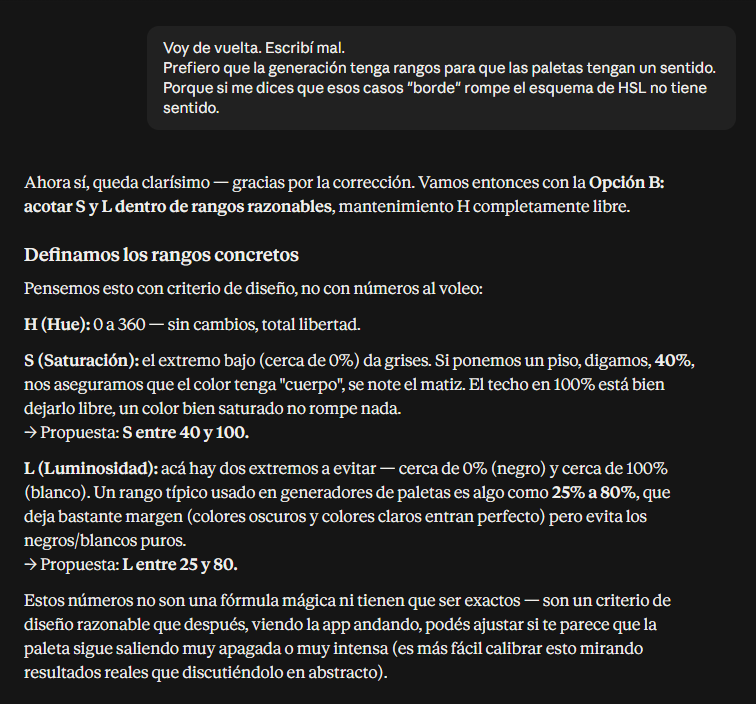

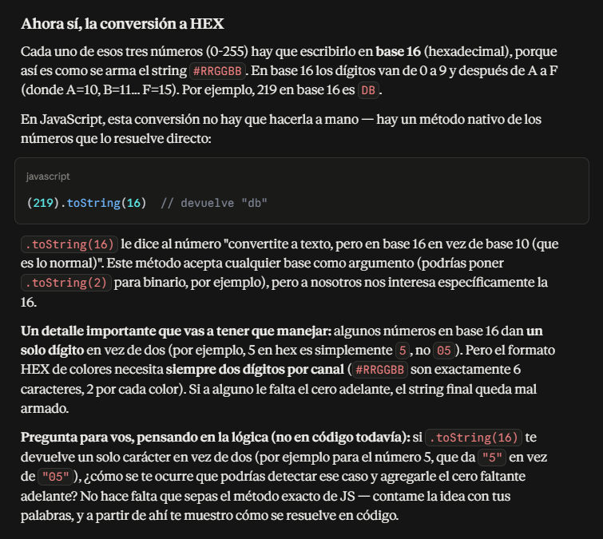

## Etapa 3 — Render dinámico de la paleta

### Prompt utilizado (resumen)

Se solicitó a la IA el desarrollo del flujo completo de render dinámico (lectura de tamaño seleccionado, generación de la paleta, y pintado en el DOM), optando esta vez por resolver todo el flujo junto en lugar de función por función, para luego revisar en conjunto cualquier duda puntual.

### Resultado obtenido

- Se implementó el flujo completo conectando las funciones de la Etapa 2 con el DOM.
- Tras la primera implementación, se pidió una explicación detallada línea por línea de la función `renderizarPaleta()`, ya que incluía conceptos nuevos (`document.createElement`, `appendChild`, `.style`, `.setAttribute`, `.textContent`, `forEach`, template literals).
- Se validó explícitamente con la IA que el enfoque utilizado (creación de nodos DOM en vez de construir HTML como texto con `innerHTML`) responde a un estándar profesional, evitando malas prácticas y riesgos de seguridad, y se identificó como simplificación consciente la ausencia de manejo de errores defensivo, quedando fuera del alcance de este proyecto.

### Captura

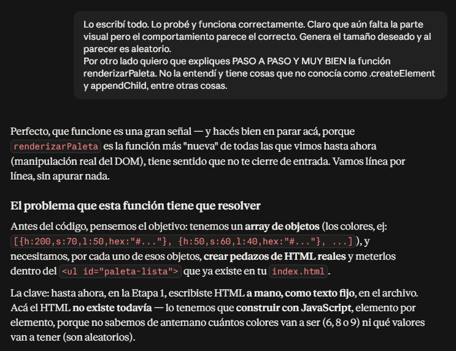

## Etapa 4 — Interacción y microfeedback

### Prompt utilizado (resumen)

Se solicitó a la IA diseñar la funcionalidad de copiado de color al portapapeles con feedback visible, definiendo antes de programar: qué código copiar (HEX, al clickear el swatch), cómo detectar clicks sobre elementos generados dinámicamente, y cómo evitar depender de datos visuales del navegador para recuperar el color exacto.

### Resultado obtenido

- Se aprendió el concepto de delegación de eventos (event delegation) y `event.target.closest()`, entendiendo por qué es necesario para elementos creados dinámicamente y por qué es más robusto que agregar listeners individuales.
- Se comprendió la diferencia entre usar datos visuales (`style.backgroundColor`) y atributos de datos (`data-*` / `.dataset`) para asociar información a un elemento del DOM, y se resolvió una confusión puntual sobre la sintaxis de `.dataset.hex` (diferenciando el nombre del atributo de la lectura de una propiedad de objeto).
- Se repasó el uso de `async/await` con `try/catch` aplicado a la API `navigator.clipboard.writeText()`.
- Se implementó el toast de feedback con atributos de accesibilidad (`role="status"`, `aria-live="polite"`), reforzando el criterio de que el microfeedback debe ser perceptible también por tecnologías de asistencia, no solo visualmente.

### Capturas

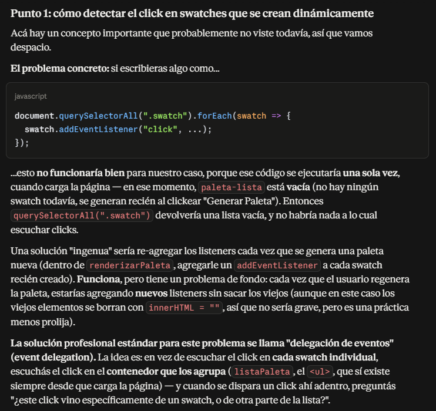

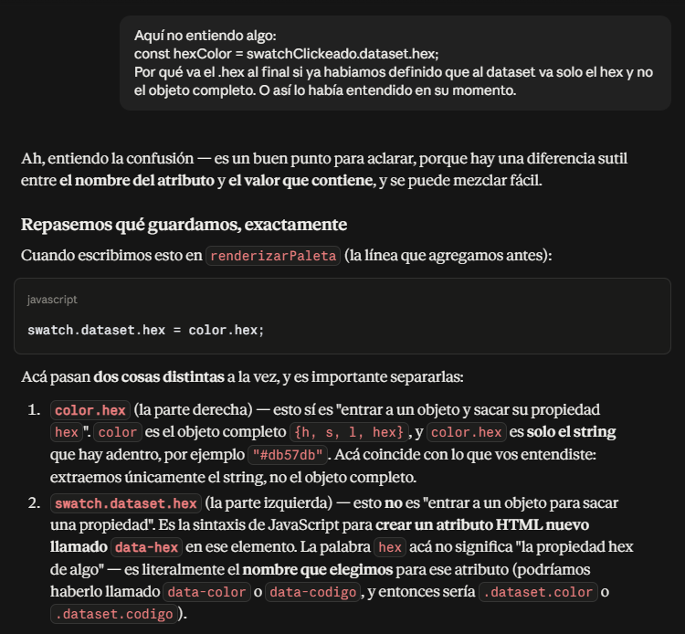

## Etapa 5 — Accesibilidad y foco visible

### Prompt utilizado (resumen)

Se solicitó a la IA una explicación desde cero (sin conocimiento previo del tema) sobre foco visible y contraste, seguida de un repaso guiado del comportamiento real de la app mediante pruebas manuales de navegación por teclado, y un repaso completo del archivo HTML final en busca de errores de accesibilidad.

### Resultado obtenido

- Se comprendió el concepto de foco visible y por qué el comportamiento por defecto del navegador no es suficiente cuando el color de fondo de un elemento interactivo es aleatorio (caso específico de los swatches).
- Mediante prueba manual de navegación por teclado, se confirmó que todos los elementos interactivos son accesibles y en orden lógico, y se detectó visualmente el problema de contraste de foco en los swatches (agravado por su tamaño, aún sin definir en CSS).
- Se revisó el asset real del logo (aportado por el estudiante) y se corrigió una decisión previa de la Etapa 1: el `alt` de la imagen y el tratamiento del `<h1>`, aplicando la técnica `.sr-only` para mantener la jerarquía semántica sin duplicar contenido visual.
- Se realizó un repaso completo del HTML final contra una checklist de accesibilidad (landmarks, jerarquía de encabezados, labels, aria-labels, toast, idioma), sin encontrarse errores adicionales.
- Quedaron documentadas como especificaciones técnicas pendientes para la Etapa 6: estilo de foco con doble contorno, dimensiones de los swatches, y elección de paleta de colores verificada con herramientas de contraste (WCAG AA).

### Captura

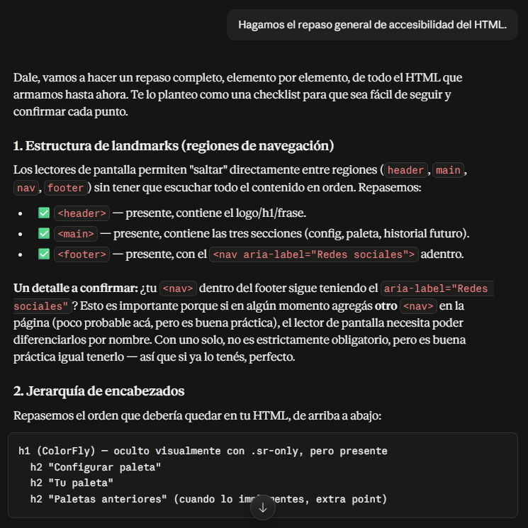

## Etapa 6 — Estilos y CSS

### Prompt utilizado (resumen)

Se trabajó la etapa dividida en sub-etapas (paleta de colores, layout general, selector de tamaño y botón, swatches, toast, footer), cada una discutida y validada antes de generar el código. Se solicitó explícitamente a la IA el uso de variables CSS y la unidad `rem` para todos los tamaños, como buena práctica ya conocida por el estudiante de ejercicios previos del bootcamp.

### Resultado obtenido

- Se definió una paleta de colores basada en el color de marca del logo (#2d3546), verificada con la herramienta WebAIM Contrast Checker, confirmando cumplimiento del estándar WCAG AA y evaluando conscientemente no perseguir AAA.
- Se aprendieron técnicas de CSS no vistas previamente: ocultar visualmente un input manteniendo su accesibilidad, el selector `:checked` combinado con el combinador de hermano adyacente (`+`) para estados reactivos sin JavaScript, la diferencia entre `:focus` y `:focus-visible`, y la técnica de doble contorno (`outline` + `box-shadow`) para foco visible robusto ante colores de fondo aleatorios.
- Se resolvió un caso técnico específico: por qué el atributo `hidden` no permite animaciones (al aplicar `display: none`), resolviéndolo mediante una clase CSS controlada por JavaScript y ajustando la temporización con `setTimeout` anidado para sincronizar la animación de salida con la reactivación del atributo `hidden`.
- Se evaluó conscientemente posponer la disposición en arco original del boceto (más compleja de calcular) en favor de una solución funcional con `flex-wrap`, documentando la primera como mejora visual futura.
- Se implementaron íconos SVG de redes sociales embebidos en el HTML, evitando dependencias externas, con buenas prácticas de accesibilidad (`aria-hidden`) y de seguridad al abrir enlaces externos (`rel="noopener noreferrer"`, agregado por iniciativa propia del estudiante).

### Capturas

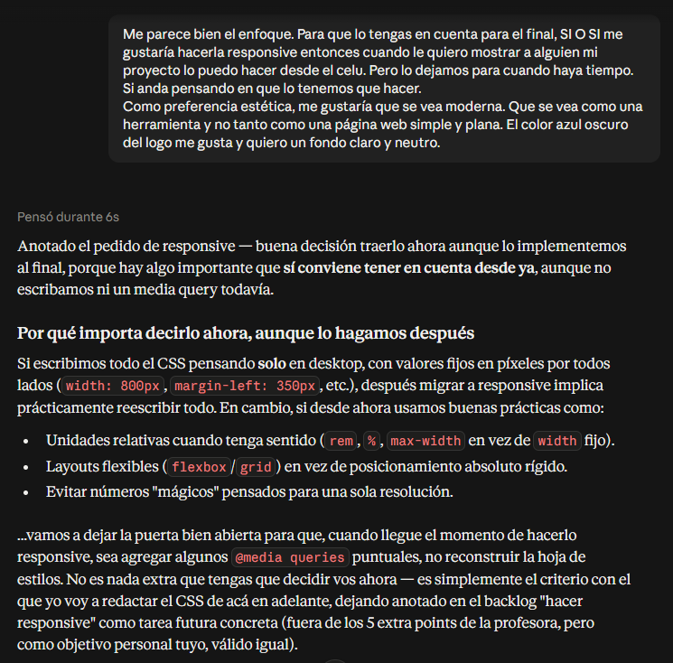

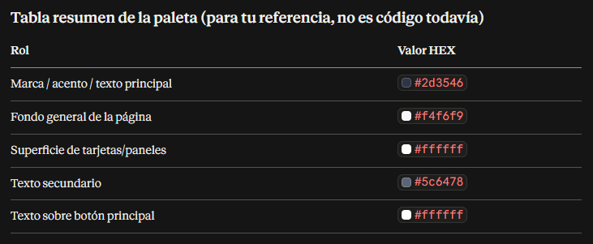

## Etapa 6 (revisión) — Ajustes de layout, contraste y limpieza de CSS

### Prompt utilizado (resumen)

Tras una primera versión de la Etapa 6, el estudiante contrastó el resultado visual contra el boceto original y detectó varias desviaciones (disposición del main, tamaño general, header/footer no fijos). Se solicitó a la IA revisar y corregir el layout completo, utilizando estrategias de depuración visual (colores de fondo temporales muy contrastantes) para identificar con precisión los límites reales de cada bloque antes de ajustar los colores definitivos.

### Resultado obtenido

- Se corrigió la disposición del `<main>` a dos columnas mediante `grid-template-areas`, resolviendo un layout previamente apilado que no correspondía al boceto acordado en la Etapa 1.
- Se resolvió un layout de una sola pantalla sin scroll general (salvo scroll interno acotado en zonas de contenido variable), evitando `position: fixed` en favor de una técnica de Grid con altura fija, considerando de antemano la compatibilidad con una futura implementación responsive (objetivo personal del estudiante, documentado como tarea pendiente).
- Se diagnosticó y corrigió un comportamiento no evidente de CSS Grid relacionado con `min-height: 0` en contenedores anidados con `1fr`.
- Se resolvió que header y footer ocuparan el ancho completo de la ventana manteniendo su contenido alineado al mismo margen que el `<main>`, mediante `padding` calculado dinámicamente con `calc()`.
- Se realizó una revisión completa del archivo CSS final a pedido del estudiante, detectándose y corrigiéndose un bloque de estilos duplicado y obsoleto que sobrescribía silenciosamente reglas vigentes — ejercicio de auditoría de código antes del cierre de la etapa.

### Captura

---

## Etapa 6 (revisión 1) — Reorganización de script.js

### Prompt utilizado (resumen)

Se solicitó a la IA revisar la estructura completa de `script.js` antes de la entrega, buscando código suelto o mal organizado, y proponer una reestructuración sin alterar la lógica ya validada en etapas anteriores.

### Resultado obtenido

- Se identificó que, si bien el código no tenía errores, el orden de aparición de las funciones y de los dos `addEventListener` no seguía una agrupación clara (estaban intercalados con otras funciones).
- Se reorganizó el archivo en bloques temáticos comentados, replicando el mismo criterio de organización ya aplicado en `styles.css`, y centralizando el registro de eventos al final del archivo como práctica de separación entre definición y activación de comportamiento.

### Captura

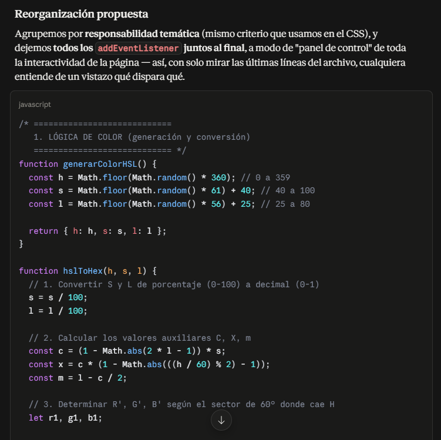

## Etapa 6 (revisión 2) - Reorganización de archivos, nomenclaturas, etc., adaptación de funcionalidad

### Prompt utlizado (resumen)

Se solicitó a la IA Gemini que haga una revisión archivo por archivo para que verifique la estructura y realice una devolución para mejorarlo. Por otro lado se solicitó luego de la primera devolución que haya una coherencia en la nomenclatura de los elementos html, selectores en la hoja de estilos y variables-funciones del script.js

### Resultado obtenido

- Identificó pequeñas mejoras para aplicar al HTML.
- Luego devolvió las porciones de código enviadas para su refactorización con el estandar solicitado y su correspondiente adaptación en la hoja de estilos y el script.

### Capturas

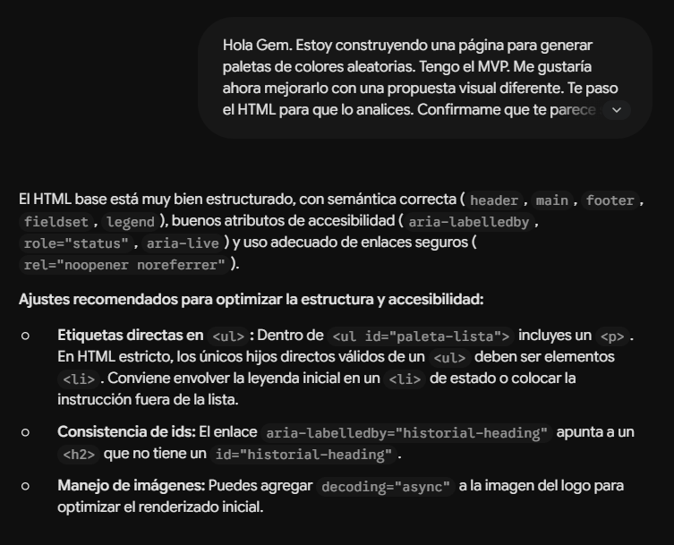

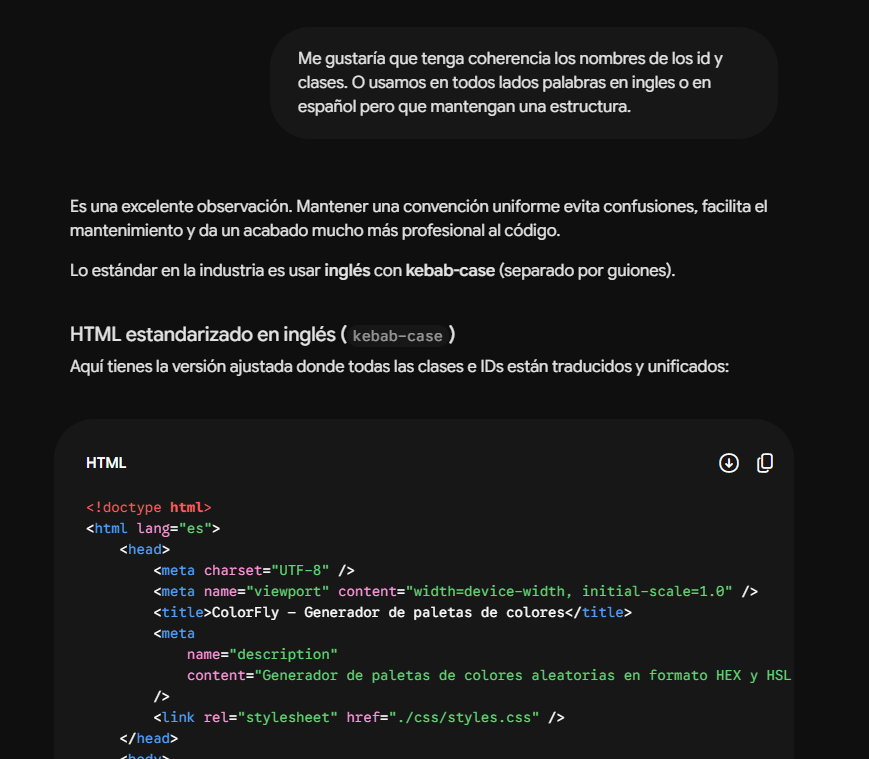

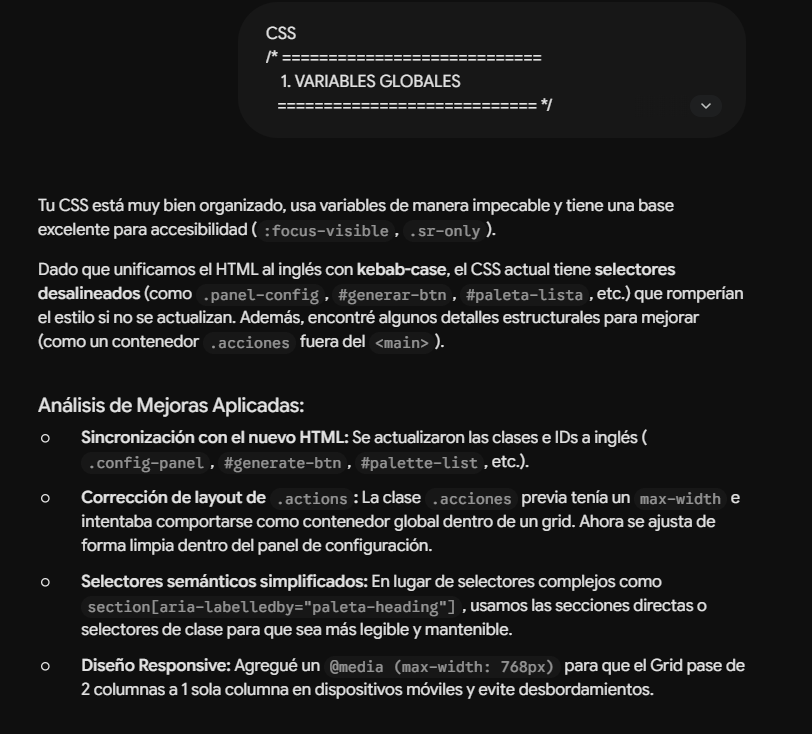

## Etapa 7 — Redacción de README.md

### Prompt utilizado (resumen)

Se solicitó a la IA armar el contenido completo del README.md, indicando como requisito explícito que incluyera un índice con links a cada sección, y que enlazara a `LOG.md` y `documentacion/uso-ia.md` en vez de repetir el contenido ya documentado ahí.

### Resultado obtenido

Se obtuvo un README.md estructurado con: descripción, demo, estado de funcionalidades (mínimas y extra credits), stack tecnológico, estructura del proyecto (con justificación de la desviación respecto a la consigna), instrucciones de ejecución local y despliegue en GitHub Pages, y una sección de decisiones técnicas que remite a `LOG.md` sin duplicarlo. El estudiante revisó el contenido generado y aplicó ajustes propios antes de incorporarlo al repositorio.

### Captura

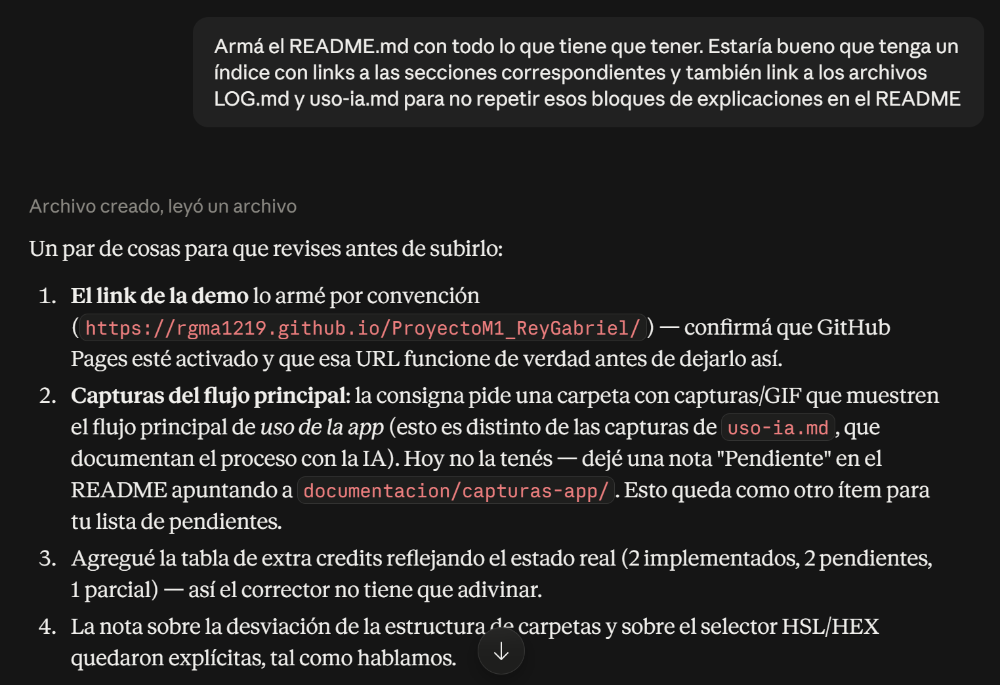

## Etapa 8 — Guardado de paletas en localStorage

### Prompt utilizado (resumen)

Se solicitó a la IA analizar, como mentor y en etapas (sin generar código hasta pedirlo explícitamente), la implementación del extra credit de guardado de paletas. El proceso incluyó: definición del modelo de datos y comportamiento (guardado manual vs. automático, límite de entradas, comportamiento al restaurar), estructura HTML semántica y accesible de cada entrada del historial, estilos CSS siguiendo la organización numerada ya existente en el proyecto, y finalmente el JavaScript de la lógica de persistencia (lectura/escritura en localStorage, render dinámico, manejo de eventos por delegación).

### Resultado obtenido

Se implementó la funcionalidad completa: botón "Guardar paleta" condicional, historial persistente en localStorage con límite de 10 entradas (FIFO), cada entrada representada con mini-swatches y accesible mediante botones independientes para restaurar y eliminar. La IA señaló durante el proceso un riesgo de accesibilidad (evitar botones anidados) y ayudó a diagnosticar y corregir un bug de alineación visual en el CSS (`width: 100%` faltante en `.history-item`). El estudiante tomó las decisiones de diseño (comportamiento manual, sin fecha, alineación de botones) y validó cada paso antes de avanzar al siguiente.

### Capturas

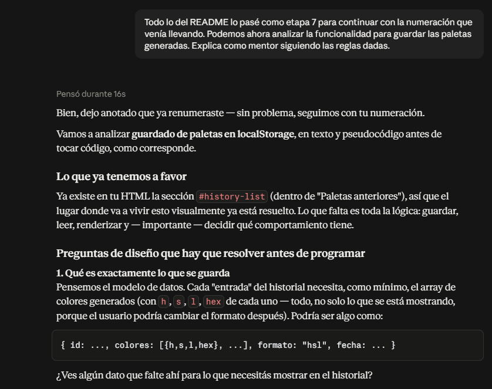

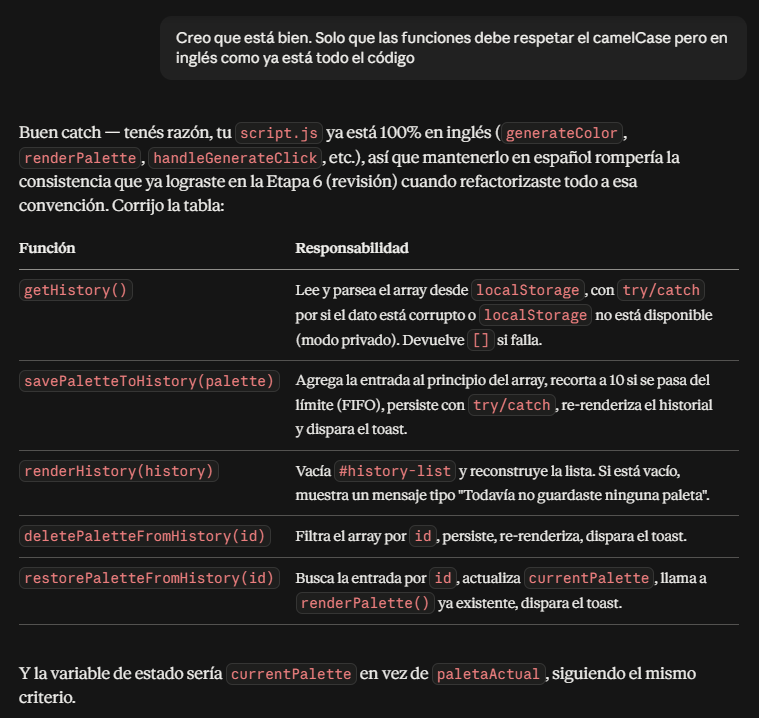

## Etapa 9 — Diseño responsive (mobile, tablet, desktop)

### Prompt utilizado (resumen)

Se solicitó a la IA, en rol de mentor, ayudar a diagnosticar y diseñar la adaptación responsive de la app a partir de un boceto propio del estudiante, definiendo primero el criterio de breakpoints (tablet y celular como layout compartido por ser dispositivos táctiles, distinto del layout de desktop) antes de escribir CSS. Durante la implementación surgieron dos bugs visuales (footer no pegado al fondo, y contenido recortado en el borde derecho); en ambos casos se pidió a la IA guiar el diagnóstico de la causa raíz antes de aplicar una corrección, en vez de parchear el síntoma directamente.

### Resultado obtenido

Se definieron 3 rangos de breakpoint con criterio de interacción (touch vs. mouse) en vez de solo ancho de pantalla, se ajustaron áreas táctiles mínimas siguiendo WCAG, y se corrigieron ambos bugs identificando primero su causa exacta (una regla de Grid heredada de una versión anterior del proyecto, y un elemento hijo desbordando su columna, detectado con un script de diagnóstico en consola en vez de prueba y error). El estudiante validó visualmente cada corrección en los tres rangos antes de dar la etapa por cerrada.

### Captura

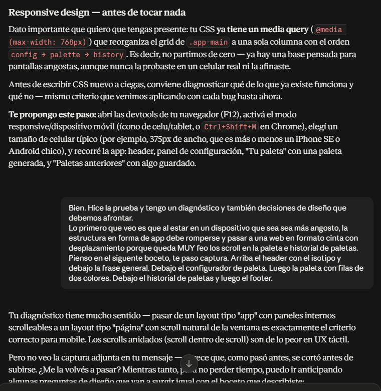

## Etapa 10 — Tooltip de ayuda contextual en swatches

### Prompt utilizado (resumen)

Se solicitó a la IA agregar un mensaje visible al pasar el mouse sobre cada swatch, indicando que el clic copia el color. Tras la primera propuesta, se iteró varias veces a partir de feedback visual directo del estudiante (demasiado invasivo, colores muy fuertes, tapaba la paleta), hasta llegar a un badge pequeño en la esquina superior derecha del swatch.

### Resultado obtenido

Se implementó el tooltip íntegramente en CSS (pseudo-elemento `::after`), sin tocar HTML ni JS. La IA señaló dos riesgos a validar por el estudiante: posible recorte del tooltip en la primera fila de la grilla por el `overflow-y` de la sección, y la limitación de que el efecto `:hover`/`:focus-visible` no es perceptible en dispositivos táctiles. Ambos puntos fueron validados visualmente por el estudiante antes de cerrar la etapa.

### Captura

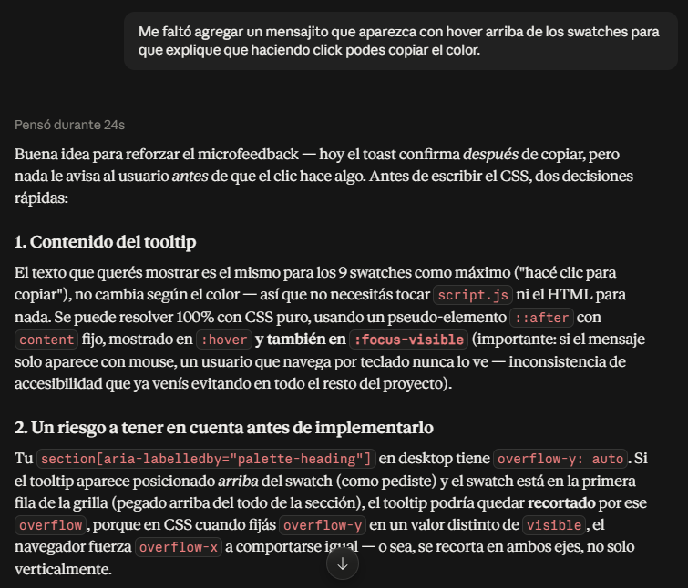

---

[Volver al Readme](./README.md)
