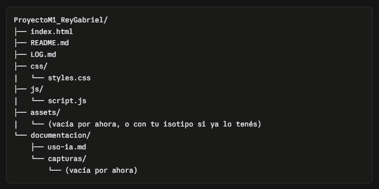
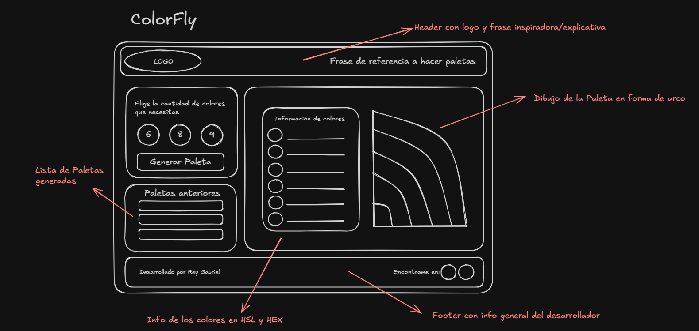

# Uso de IA en el desarrollo de ColorFly

Este documento registra cómo se utilizó IA (Claude, Anthropic) como asistente/tutor durante el desarrollo del proyecto, incluyendo el criterio de trabajo, los prompts principales y los resultados obtenidos en cada etapa.

**Metodología de trabajo con la IA:** se definieron reglas explícitas desde el inicio: la IA no debía generar código salvo que se lo solicitara expresamente, y las soluciones debían debatirse primero en texto/pseudocódigo antes de implementarse. El objetivo fue usar la IA como mentor de criterio (arquitectura, semántica, accesibilidad), no como generador automático de código.

---

## Etapa 0 — Planificación y estructura del proyecto

### Prompt utilizado (resumen)

Se solicitó a la IA actuar como tutor del proyecto integrador, estableciendo reglas de trabajo (no generar código sin pedido expreso, avanzar por etapas validadas, mantener un LOG.md, y actuar como mentor señalando fallas de lógica/accesibilidad/semántica). Se pidió luego definir la estructura de carpetas del proyecto y el criterio de nomenclatura de commits.

### Resultado obtenido

Se acordó una estructura estándar de proyecto estático (`index.html`, `css/`, `js/`, `assets/`, `README.md`, `LOG.md`, `documentacion/`), un flujo de trabajo en rama `main` con commits siguiendo convención tipo _conventional commits_ (`feat`, `fix`, `chore`, `docs`), y criterio para la descripción del repositorio en GitHub.

### Captura

---

## Etapa 1 — Estructura HTML semántica

### Prompt utilizado (resumen)

Se compartió un boceto propio (papel → digitalizado en Excalidraw) con el diseño visual de la app, pidiendo a la IA analizarlo junto con el estudiante para derivar una estructura HTML semántica, sin escribir código hasta validar las decisiones.

### Resultado obtenido

Mediante preguntas guiadas, se resolvieron en conjunto:

- Separación entre isotipo/logotipo (header) y el `h1` real de la página.
- Uso de `fieldset` + `legend` + inputs `radio` (en vez de botones sueltos) para el selector de tamaño de paleta, por tratarse de una selección única y por motivos de accesibilidad por teclado.
- Identificación de "Paletas anteriores" como funcionalidad fuera del alcance obligatorio (movida a _extra points_).
- Unificación de la visualización del color (swatch) y sus códigos (HEX/HSL) en un mismo bloque semántico, evitando que la asociación color↔código dependiera solo del orden visual.
- Definición de mostrar ambos códigos (HEX y HSL) siempre visibles y con igual jerarquía, por requisito explícito de la consigna.
- Ubicación del botón "Generar Paleta" fuera de las secciones de configuración y resultado, como acción independiente.
- Jerarquía de encabezados: un único `h1`, y `h2` para cada sección temática.

A partir de estas decisiones, la IA proporcionó el código HTML completo y comentado del `index.html`, que el estudiante transcribió y validó manualmente.

### Captura

